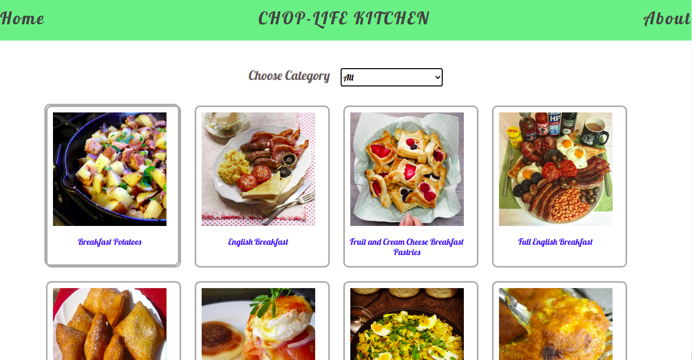

# MEAL RECIPE APP (CHOP-LIFE KITCHEN)

> MEAL RECIPE APP is a meal catalogue app built with React and Redux. This app fetches data from MealDB API and displays the data on the page. The user can filter the foods according to categories.

NB: In this React Capstone project, I was asked to build a CATALOGUE OF DOG CLOTHES but after an unsuccessful search for an API for the app online, i decided to use MealDB API instead.



## Built With

- Node.js
- React
- React-DOM
- Redux
- CSS
- ES6
- npm

## Getting Started

To run this project locally, make sure you have done the following:

- Installed Node.js, more information [here](https://nodejs.org/en/)
- Installed Node package manager

- Get a copy of the project by running

```
 git clone git@github.com:Nasa28/Meal_Recipe.git

```

on your terminal.

### Setup, Installations and usage

- cd into the project
- open the project using code editor of your choice
- Run `npm install` to install all dependencies
- Run `npm start` to start the server
- Open your prefered browser
- Visit `http://localhost:3000/`

## Live version

[Live Version]()

## RUN TEST

```
npm test

```

## Authors

👨‍💻 **Kalu Chinasa Agu**

- Github: [@Nasa28](https://github.com/Nasa28)
- Twitter: [@Ultimate_Nasa](https://twitter.com/Ultimate_Nasa)
- LinkedIn: [LinkedIn](https://www.linkedin.com/in/kalu-chinasa-agu-a15080103/)

## 🤝 Contributing

Contributions, issues, and feature requests are welcome!

Feel free to check the [issues page](https://github.com/Nasa28/Meal_Recipe/issues).

## Acknowledgements

[Microverse](https://www.microverse.org/)

[Denys Chagaida on Behance](https://www.behance.net/chagaida)

## Show your support

Give a ⭐️ if you like this project!

## 📝 License

This project is [MIT](https://github.com/stevenvachon/broken-link-checker/blob/main/license) licensed.
